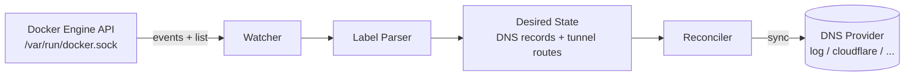

# DockRoute — Architecture

DockRoute watches running Docker containers, reads `dockroute.*` labels
(annotations) and reconciles them against a pluggable DNS provider —
the same idea as Kubernetes [external-dns](https://github.com/kubernetes-sigs/external-dns),
but for plain Docker hosts.

The central principle:

> **DockRoute never alters what it cannot prove it manages.**

## High-level flow



1. **Watcher** (`src/docker/watcher.ts`) — connects to the Docker socket
   (Bun's `fetch` supports `unix:` sockets natively). On startup it lists all
   running containers; afterwards it streams `/events` (container `start`,
   `die`, `stop`) and triggers a reconciliation on every relevant event.
   A periodic full re-list acts as a safety net against missed events.
2. **Label Parser** (`src/core/labels.ts`) — extracts `dockroute.*` labels
   from each container and turns them into a desired state: plain
   `DnsRecord`s or `TunnelRoute`s. Containers without
   `dockroute.enabled=true` are ignored.
3. **Reconciler** (`src/core/reconciler.ts`) — merges the desired state from
   *all* running containers (deduplicating hostnames — first container wins)
   and hands it to the provider. The provider owns the diff
   (create / update / delete).
4. **Provider** (`src/providers/`) — one interface, many implementations:
   - `log` — dry-run, prints the desired state. Default; lets the whole
     pipeline run with zero credentials.
   - `cloudflare` — DNS records + Cloudflare Tunnel ingress routes, with
     TXT-based ownership.
   - `pihole` — Pi-hole v6 local DNS for intranet-only hostnames
     (filter-scoped ownership, see below).
   - `route53`, `rfc2136`, ... — future.

## Ownership (TXT registry)

Modeled after ExternalDNS's TXT registry. Every data record DockRoute
creates gets a companion TXT record:

- **Name:** `<txt-prefix><record-type>.<hostname>` — e.g. the A record for
  `whoami.example.com` is tracked by `_dockroute-a.whoami.example.com`.
  The prefix avoids CNAME-coexistence issues and the embedded type
  disambiguates multiple record types at the same name.
- **Content:** `heritage=dockroute,dockroute/owner=<owner-id>[,dockroute/resource=container/<id>]`

A record is *owned* only when its companion TXT exists, carries
`heritage=dockroute` and the matching `dockroute/owner`. The rules, enforced
by the provider-agnostic planner (`src/providers/registry/planner.ts`):

- Existing record with no ownership TXT → **conflict**: logged and skipped,
  never modified, never adopted.
- Existing record owned by another owner id → conflict, skipped. Multiple
  DockRoute instances can safely share one zone with distinct
  `DOCKROUTE_OWNER_ID`s.
- Orphaned records (owner's container is gone) are deleted **only** under
  the `sync` policy and only when ownership is proven.
- Dangling ownership TXT (data record manually deleted): recreate the record
  if still desired, clean up the TXT under `sync` if not.

## Sync policies

`DOCKROUTE_POLICY`, same semantics as ExternalDNS:

| Policy | Creates | Updates owned | Deletes owned orphans |
| ------------- | ------- | ------------- | --------------------- |
| `sync` (default) | ✓ | ✓ | ✓ |
| `upsert-only` | ✓ | ✓ | — |
| `create-only` | ✓ | — | — |

Conflicts (anything not owned) are never touched under any policy.

## Cloudflare Tunnel (existing-tunnel model)

DockRoute does **not** create tunnels or move traffic — you create the tunnel
and run `cloudflared`; DockRoute manages, via the Cloudflare API:

1. the **public-hostname ingress rules** in the tunnel's remotely-managed
   configuration, and
2. the proxied **CNAME records** pointing each hostname at
   `<tunnel-id>.cfargotunnel.com`.

A container opts in with `dockroute.tunnel.service` (e.g. `http://whoami:80`).
Tunnel mode takes precedence over plain `dockroute.type`/`dockroute.target`.

Safety around the tunnel configuration endpoint (the PUT replaces the whole
ingress list):

- An ingress rule is *managed* iff its hostname is proven ours through the
  TXT registry (owned CNAME pointing at the tunnel domain). Everything else
  is preserved verbatim, in its original order, ahead of managed rules — a
  pre-existing rule never starts being shadowed by ours.
- An unmanaged rule already claiming a desired hostname is a conflict:
  logged and skipped.
- The catch-all rule (last, no hostname) is always preserved; a fresh ingress
  gets `http_status:404`.
- The configuration is re-read immediately before writing and only written
  when it actually changed. The endpoint is last-writer-wins, so DockRoute
  assumes it is the **only automated writer** for the tunnels it manages.

## Pi-hole (filter-scoped ownership)

The `pihole` provider writes **local DNS** entries through the Pi-hole v6
REST API: A/AAAA records as `"IP hostname"` entries in `dns.hosts`, CNAMEs as
`"source,target[,ttl]"` entries in `dns.cnameRecords`. Its purpose is
split-horizon setups — hostnames that must resolve only inside the LAN while
a second DockRoute instance publishes the rest through a public provider.

Pi-hole local DNS cannot carry TXT records, so the TXT registry does not
apply. Instead, ownership is scoped by configuration — the same model the
tunnel ingress uses ("DockRoute assumes it is the only automated writer for
what it manages"):

- `DOCKROUTE_DOMAIN_FILTER` is **required** (startup error without it).
- Hostnames matching the filter are treated as exclusively DockRoute-managed;
  sync policies keep their usual semantics inside that boundary (`sync`
  deletes orphans there, including manually created entries — documented).
- Anything outside the filter is never created, updated or deleted.
- Multi-hostname entries (`ip host1 host2`) are left unmanaged and skipped
  with a warning, even inside the filter.
- A/AAAA TTLs are ignored (hosts entries have none); CNAME TTLs are honored.
- Updates are delete-then-add: Pi-hole config entries are plain strings with
  no stable id.
- Auth is a session `sid` from `POST /api/auth` (app password), re-acquired
  once on 401; tunnel routes are warned about and skipped.

## Label schema

| Label                        | Required | Default                    | Description                                  |
| ---------------------------- | -------- | -------------------------- | -------------------------------------------- |
| `dockroute.enabled`          | yes      | —                          | `true` opts the container in                 |
| `dockroute.hostname`         | yes      | —                          | FQDN(s), comma-separated                     |
| `dockroute.type`             | no       | `A`                        | `A`, `AAAA` or `CNAME`                       |
| `dockroute.target`           | no       | `DOCKROUTE_DEFAULT_TARGET` | Record value (IP or CNAME target)            |
| `dockroute.ttl`              | no       | `300`                      | Record TTL in seconds                        |
| `dockroute.tunnel.service`   | no       | —                          | Origin URL (`http://svc:port`); switches the container to tunnel publishing |
| `dockroute.cloudflare.proxied` | no     | `false`                    | Serve plain records through Cloudflare's proxy |

Example:

```yaml
services:
  whoami:
    image: traefik/whoami
    labels:
      dockroute.enabled: "true"
      dockroute.hostname: "whoami.example.com"
      dockroute.tunnel.service: "http://whoami:80"
```

## Configuration (environment variables)

| Variable                   | Default                | Description                             |
| -------------------------- | ---------------------- | --------------------------------------- |
| `DOCKER_SOCK`              | `/var/run/docker.sock` | Docker Engine socket path               |
| `DOCKROUTE_PROVIDER`       | `log`                  | DNS provider to use                     |
| `DOCKROUTE_DEFAULT_TARGET` | —                      | Fallback target when label is omitted   |
| `DOCKROUTE_RESYNC_SECONDS` | `60`                   | Interval of the periodic full reconcile |
| `DOCKROUTE_OWNER_ID`       | `default`              | Ownership id written into registry TXTs |
| `DOCKROUTE_POLICY`         | `sync`                 | `sync`, `upsert-only` or `create-only`  |
| `DOCKROUTE_TXT_PREFIX`     | `_dockroute-`          | Registry TXT name prefix                |
| `DOCKROUTE_DOMAIN_FILTER`  | —                      | Comma-separated zone allowlist (required for `pihole`) |
| `CLOUDFLARE_API_TOKEN`     | —                      | Required for `cloudflare`. Scopes: Zone → DNS → Edit; Account → Cloudflare Tunnel → Edit (tunnel only) |
| `CLOUDFLARE_ACCOUNT_ID`    | —                      | Required for tunnel features            |
| `CLOUDFLARE_TUNNEL_ID`     | —                      | Required for tunnel features            |
| `PIHOLE_URL`               | —                      | Required for `pihole`: v6 base URL      |
| `PIHOLE_PASSWORD`          | —                      | Required for `pihole`: app password     |

## Source layout

```
src/
  index.ts              entrypoint — wiring only
  config.ts             env-based configuration (policy validation lives here)
  docker/
    client.ts           minimal Docker Engine API client (unix socket)
    watcher.ts          event stream + periodic resync → triggers reconcile
  core/
    types.ts            DnsRecord, TunnelRoute, DesiredState, ContainerInfo
    labels.ts           dockroute.* label parsing → DesiredState
    reconciler.ts       desired state merge/dedupe → provider.sync()
  providers/
    provider.ts         Provider interface + registry
    log.ts              dry-run provider (default)
    registry/
      ownership.ts      TXT ownership format + naming (provider-agnostic)
      planner.ts        pure reconciliation planner: policies, conflicts, orphans
    cloudflare/
      api.ts            Cloudflare v4 wire client (wire types stay here — ACL)
      cloudflare.ts     provider: zones, planner execution, TTL normalization
      tunnel.ts         pure ingress merge (managed/unmanaged/catch-all)
    pihole/
      api.ts            Pi-hole v6 wire client: session auth, dns.hosts,
                        dns.cnameRecords (wire formats stay here — ACL)
      pihole.ts         provider: filter-scoped ownership, hosts/CNAME diff
```

## Design decisions

- **Full-state sync, not incremental patches.** Every reconcile recomputes
  the complete desired set from the Docker API and syncs it. Simpler,
  self-healing, and events only decide *when* to reconcile, never *what*.
- **Provider owns the diff, planner owns the rules.** The ownership/policy
  logic is provider-agnostic (`src/providers/registry/`); each provider maps
  its wire format at its own boundary and never leaks it into `src/core/`
  (anti-corruption layer).
- **No database.** Docker is the source of truth for desired state; the DNS
  provider plus the TXT registry is the source of truth for actual state and
  ownership. The container stays stateless and disposable.
- **Proxied TTL normalization.** Cloudflare forces TTL `1` (auto) on proxied
  records; both sides are normalized before diffing so reconciles converge
  instead of issuing no-op updates forever.
